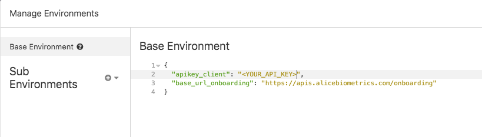

# onboarding-insomnia

ALiCE Onboarding API provides the core functionalities of an onboarding process. It includes:

* Creation and management of user profiles for onboarding
* Adding identity documents, driving licences, passports, residence cards, etc. associated with a user, as well as selfie videos.
* Automatic processing and reading of relevant information from those documents for onboarding processes.
* Identity verification of the user against the photographs of the documents, providing a facial matching score for each document.
* PAD analysis to detect signs of spoofing attacks through printed photographs or pictures and videos shown on screen.
* Generation of reports with all the information extracted from a user for onboarding processes.

## Table of Contents
- [ALiCE Onboarding API](#alice-onboarding-api)
- [Onboarding Workflow](#onboarding-workflow)
- [Getting Started :chart_with_upwards_trend:](#getting-started-chart_with_upwards_trend)
- [Documentation :page_facing_up:](#documentation-page_facing_up)
- [Contact :mailbox_with_mail:](#contact-mailbox_with_mail)

## ALiCE Onboarding API

Swagger Info: 

* [Auth](https://apis.alicebiometrics.com/auth/ui/#/)
* [Onboarding](https://apis.alicebiometrics.com/onboarding/ui/#/)

## Onboarding Workflow

## Getting Started :chart_with_upwards_trend:

The following Insomnia Workspace will help you to better understand the flow of the API.

1. [Download](demo-alice-onboarding-insomnia.zip) the Workspace project (`Insomnia v4 - JSON`).
2. Import the Workspace in the Insomnia. `Import/Export -> Import Data -> From File`
3. Activate just installed Workspace Demo ALiCE Onboarding.
4. Configure your API TOKEN. `Manage Environments -> Base Environment -> apikey_client`

5. Check following steps to complete an ALiCE Onboarding using Insomnia:

## Documentation :page_facing_up:

For more information about ALiCE Onboarding:  https://docs.alicebiometrics.com/onboarding/

## Contact :mailbox_with_mail:

support@alicebiometrics.com
